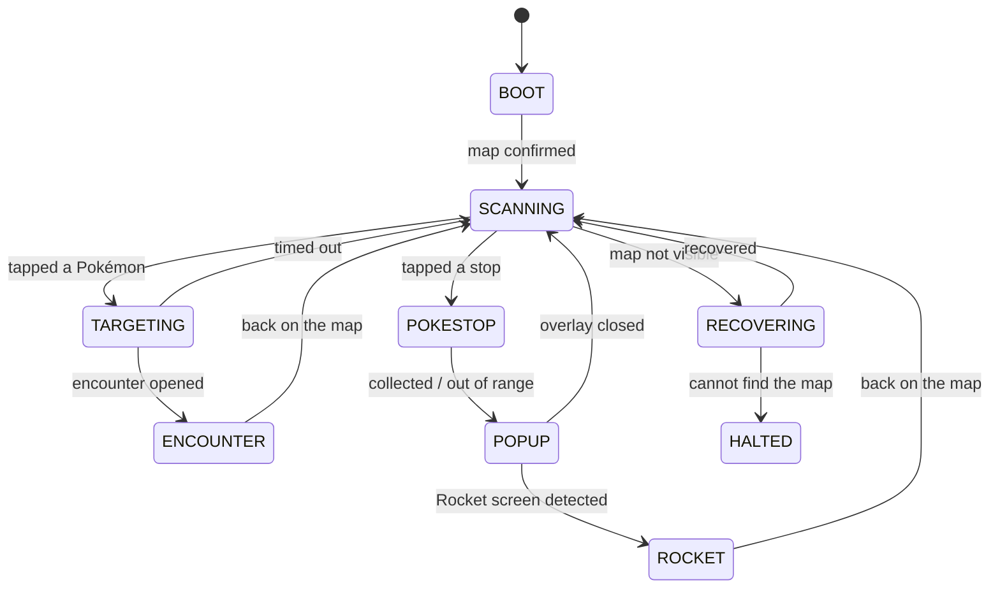

# PoGoBot

A computer-vision bot for Pokémon GO on Android. It reads the screen over `scrcpy`,
locates targets with YOLOv8, decides what to do with a pure state machine, and acts
through `adb`.

The state machine and the perception layer import without a phone, a GPU, or a model, so
the whole decision surface is unit-testable: **44 tests run in under 4 seconds.**

```bash
python3 -m pogobot                 # run against a connected phone
python3 -m pogobot --dry-run       # perceive and decide, but never touch the device
python3 -m pogobot --replay <dir>  # run against saved frames, no phone at all
```

## Requirements

- Python 3.10+
- [`scrcpy`](https://github.com/Genymobile/scrcpy) 2.0+ and `adb` on your `PATH`
- An Android device with USB debugging enabled, Pokémon GO in the foreground

```bash
pip install -r requirements.txt
adb devices          # confirm the device is listed and authorized
python3 -m pogobot --dry-run
```

Start with `--dry-run`. It runs the full pipeline and prints every decision without
sending a single tap.

> Turn **off** the *Pointer location* developer option. It draws a white readout across
> the top of the screen, which lands inside the region used to detect the encounter UI and
> is baked into every frame the bot saves.

## How it works

```
scrcpy ──▶ capture ──▶ perception ──▶ fsm ──▶ actions ──▶ adb
           Frame        Observation    Effect
```

Each stage has one job and one contract:

| module | responsibility |
|---|---|
| `capture.py` | `ScrcpySource` (keeps only the newest frame) and `ReplaySource` |
| `perception.py` | **pure**: `Frame -> Observation`. No adb, no disk, no globals |
| `fsm.py` | **pure**: `(Observation, Context) -> list[Effect]` |
| `actions.py` | the only code permitted to invoke `adb` |
| `learning.py` | the only code permitted to write data |
| `runner.py` | the only module holding both a `FrameSource` and an `Actuator` |
| `config.py` | every threshold and timing constant, one frozen dataclass |

### The state machine



Three properties are enforced structurally rather than by convention:

1. **Handlers cannot write `state`.** They return a `Transition` and one function applies
   it, stamping the clock and resolving the pending tap-intent.
2. **Timeouts are checked before handler bodies run**, so a timeout can never be shadowed
   by an earlier branch. Every handler must declare `timeout_s` and `on_timeout` or the
   package raises at import.
3. **Every effect coordinate is a normalized float.** Stream pixels and device pixels
   cannot be mixed because only one of them is representable.

### Perception

Every optical threshold is a **fraction of its region's area**, never a pixel count, so
changing `--max-size` cannot silently disable a check. Buttons are **located, never
assumed** — every finder returns `Optional`, and no located button means no tap.

Calibrated against 235 labelled frames:

| signal | behaviour |
|---|---|
| map (red Pokéball **and** orange binoculars) | 79% recall, ~0% false positive — used as a precision-first veto |
| close button | 93% on menu screens, 1% on encounters |
| affirmative pill | 100% on the Rocket BATTLE / party screens, 4% on menus |

The classifier answers what optics cannot, behind those vetoes, with an N-of-M stabilizer
so no single frame can move the machine. Over 321 real frames it agrees with the optical
map signal 97.9% of the time.

### Learning

The bot **never writes training data**. It curates frames into
`datasets/active_v2/review/` with the detector's own predictions as a starting point,
marked `verified: false`, ranking frames where the bot was **wrong** and frames containing
objects it was **unsure** about first.

```bash
python3 tools/promote_reviewed.py --list          # the queue, most informative first
#   ... correct the labels by hand ...
python3 tools/promote_reviewed.py --promote --yes
```

Training on unreviewed model output is self-training, which measurably degraded the
previous detector (3.23 → 2.38 detections per frame over three generations).

## Models

Trained on `det_v3` (186/21/11 images, 4 classes) — verified to have no cross-split
leakage, no duplicate images, and no empty label files.

| detector | size | class-agnostic recall | mAP50 |
|---|---|---|---|
| previous | 6 MB | 23.3% | not measurable — its validation set was leaked |
| **`yolov8n` (shipped)** | **6 MB** | **69.2%** | 0.494 |
| `yolov8s` (train locally) | 85 MB | 75.9% | 0.609 |

Only the compact model is committed; an 85 MB weight file is not something every clone
should download. The bot automatically prefers `models/v3/det_s/weights/best.pt` when it
exists, so training the larger one is opt-in:

```bash
python3 tools/adopt_best_detector.py             # compare candidates on held-out val
python3 tools/adopt_best_detector.py --install   # install the winner
```

Per-class mAP50 for `yolov8s`: pokemon 0.806, gym 0.699, pokestop_rocket 0.622,
pokestop 0.309.

The screen classifier is 5-class — Overworld / PokemonEncounter / Menu / Poi / Rocket —
and scores 100% on its held-out split.

`adopt_best_detector.py` ranks by class-agnostic localization recall rather than mAP,
because candidate models have different class counts and what the bot needs is *did it
find the object at all*.

## Configuration

| flag | default | meaning |
|---|---|---|
| `--dry-run` | off | decide but never actuate |
| `--replay DIR` | – | read frames from a directory instead of a phone |
| `--catch-mode` | `throw` | `throw`, `flee`, or `manual` |
| `--target-mode` | `all` | `all`, `pokemon`, or `pokestop` |
| `--no-rockets` | off | skip Team GO Rocket stops |
| `--confidence` | 0.15 | detector floor (the FSM acts at 0.30) |
| `--infer-fps` | 8.0 | inference rate |
| `--trace PATH` | `logs/trace.jsonl` | one JSON record per tick |

Everything else lives in `pogobot/config.py` as a frozen dataclass.

The trace is one line per tick with the state, both perception opinions, the raw optical
scores, and the effects issued — enough to reconstruct any session after the fact.

## Development

```bash
python3 -m pytest tests/ -q
```

`tests/test_fsm_livelocks.py` encodes each failure mode of the previous bot as a test.
`tests/test_perception_golden.py` runs the optical layer over the labelled corpus and
includes a sweep from `--max-size 1920` down to `540` asserting the signals hold.

## Known limitations

- **PokéStop detection is the weakest class** (mAP50 0.309 on the larger model). Labelling more
  stops is the highest-value improvement available.
- **Gym screens can classify as `PokemonEncounter`** — the `Poi` class has only 8 training
  samples. The 0.60 confidence gate refuses them and the 25s encounter timeout bounds the
  cost, but it is a real gap.
- **Rocket battling relies on the in-game auto-battler.** The bot presses BATTLE and
  confirms the party; it does not dodge or time charged moves.
- Cooldowns are anchored to screen position, so they are invalidated whenever the camera
  rotates. They are not a substitute for real world coordinates.

## Repository layout

```
pogobot/     the bot
tests/       44 tests, no device required
tools/       dataset review and model selection
docs/        design notes and the v1 audit
legacy/      previous generations, unmaintained
```

## Background

`docs/audit.md` documents the 106 confirmed defects found in the previous single-file bot
and how the current structure makes each class of them unrepresentable. It is worth
reading before changing the state machine or the perception thresholds.
