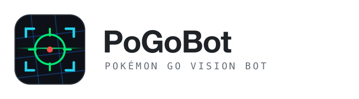
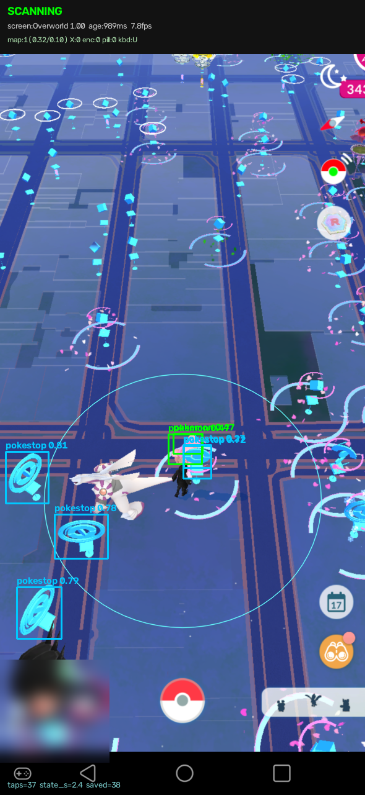
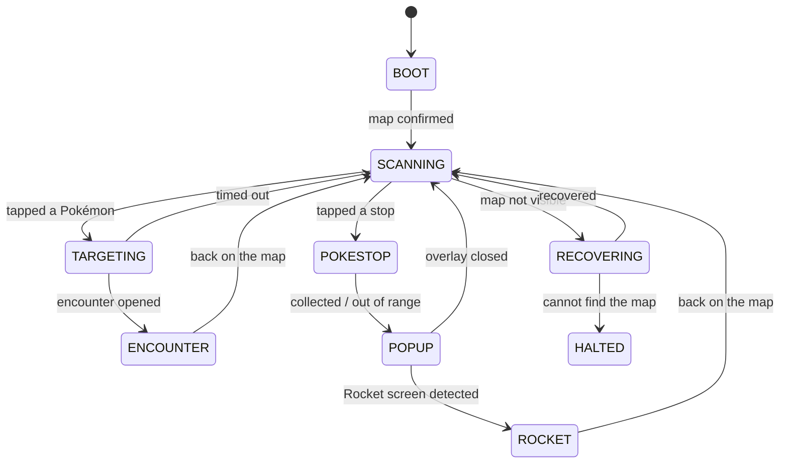

<div align="center">

<picture>
  <source media="(prefers-color-scheme: dark)" srcset="assets/logo-dark.png">
  
</picture>

### A computer-vision bot for Pokémon GO

[](https://github.com/1tzkaos/PoGoBot/releases/tag/v2.0.0)
[](#requirements)
[](https://www.python.org/)
[](#development)
[](#models)
[](https://github.com/ultralytics/ultralytics)
[](LICENSE)

**[Quick Start](#quick-start) · [How It Works](#how-it-works) · [Models](#models) · [Configuration](#configuration)**

Reads the screen over `scrcpy`, finds targets with YOLOv8, decides with a pure state
machine, and acts through `adb`.



</div>

---

## Features

- **Detects and taps** Pokémon, PokéStops, Rocket stops and gyms with a 4-class YOLOv8 detector
- **Pure state machine** — `(Observation, Context) -> list[Effect]`, importable without a phone, a GPU, or a model
- **Bounded failure** — every state declares a timeout and an escape, enforced at import time
- **Two-source perception** — optical signals veto the classifier, with an N-of-M stabilizer so no single frame moves the machine
- **Team GO Rocket** — presses BATTLE and confirms the party, then lets the in-game auto-battler run
- **Honest learning loop** — curates frames into a human review queue instead of training on its own guesses
- **Full trace** — one JSON record per tick with both perception opinions, the raw scores, and every effect
- **50 tests in under 4 seconds**, no device required
- **Replay mode** — run the entire bot against saved frames with nothing plugged in

## Interface

The HUD shows the current state, both perception opinions, the raw optical scores behind
them, the player's interaction range, and every detection with its confidence.

```
SCANNING
screen:Overworld 1.00  age:989ms  7.8fps
map:1(0.32/0.10) X:0 enc:0 pill:0 kbd:U
```

`map:1(0.32/0.10)` means the optical map signal fired, with a red-Pokéball fraction of
0.32 and an orange-binoculars fraction of 0.10. Every number the bot decides on is on
screen and in the trace.

## Requirements

| | |
|---|---|
| Python | 3.10 or newer |
| Tools | [`scrcpy`](https://github.com/Genymobile/scrcpy) 2.0+ and `adb` on your `PATH` |
| Device | Android with USB debugging enabled, Pokémon GO in the foreground |
| Accel | Apple Silicon (MPS) or CUDA optional — CPU works, just slower |

> Developed and verified on macOS with Apple Silicon. Linux and Windows should work
> — `scrcpy` and `adb` support both — but are untested.

## Quick Start

```bash
git clone https://github.com/1tzkaos/PoGoBot.git
cd PoGoBot
pip install -r requirements.txt

adb devices                    # confirm the device is listed and authorized
python3 -m pogobot --dry-run   # full pipeline, prints decisions, sends no taps
```

When the dry run looks right, drop the flag:

```bash
python3 -m pogobot
```

| command | what it does |
|---|---|
| `python3 -m pogobot` | run against a connected phone |
| `python3 -m pogobot --dry-run` | perceive and decide, never touch the device |
| `python3 -m pogobot --replay <dir>` | run against saved frames, no phone at all |
| `python3 -m pytest tests/ -q` | 50 tests, no device required |

> [!IMPORTANT]
> Turn **off** the *Pointer location* developer option. It draws a white readout across
> the top of the screen, which lands inside the region used to detect the encounter UI and
> is baked into every frame the bot saves.

## How It Works

```
scrcpy ──▶ capture ──▶ perception ──▶ fsm ──▶ actions ──▶ adb
           Frame        Observation    Effect
```

| module | responsibility |
|---|---|
| `capture.py` | `ScrcpySource` (keeps only the newest frame) and `ReplaySource` |
| `perception.py` | **pure**: `Frame -> Observation`. No adb, no disk, no globals |
| `fsm.py` | **pure**: `(Observation, Context) -> list[Effect]` |
| `actions.py` | the only code permitted to invoke `adb` |
| `learning.py` | the only code permitted to write data |
| `runner.py` | the only module holding both a `FrameSource` and an `Actuator` |
| `config.py` | every threshold and timing constant, one frozen dataclass |

### State machine



Three properties are enforced structurally rather than by convention:

1. **Handlers cannot write `state`.** They return a `Transition` and one function applies
   it, stamping the clock and resolving the pending tap-intent.
2. **Timeouts are checked before handler bodies run**, so a timeout can never be shadowed
   by an earlier branch. Every handler must declare `timeout_s` and `on_timeout` or the
   package raises at import.
3. **Every effect coordinate is a normalized float.** Stream pixels and device pixels
   cannot be mixed, because only one of them is representable.

### Perception

Every optical threshold is a **fraction of its region's area**, never a pixel count, so
changing `--max-size` cannot silently disable a check. Buttons are **located, never
assumed** — every finder returns `Optional`, and no located button means no tap.

Calibrated against 235 labelled frames:

| signal | behaviour |
|---|---|
| map — red Pokéball **and** orange binoculars | 79% recall, ~0% false positive → used as a precision-first veto |
| close button | 93% on menu screens, 1% on encounters |
| affirmative pill | 100% on the Rocket BATTLE / party screens, 4% on menus |

The classifier answers what optics cannot, behind those vetoes. Over 321 real frames it
agrees with the optical map signal 97.9% of the time.

## Models

Trained on `det_v3` (186/21/11 images, 4 classes) — verified to have no cross-split
leakage, no duplicate images, and no empty label files.

| detector | size | class-agnostic recall | mAP50 |
|---|---|---|---|
| previous | 6 MB | 23.3% | not measurable — its validation set was leaked |
| **`yolov8n`** (shipped) | **6 MB** | **69.2%** | 0.494 |
| `yolov8s` (opt-in) | 85 MB | **75.9%** | **0.609** |

Only the compact model is committed; an 85 MB weight file is not something every clone
should download. The bot automatically prefers `models/v3/det_s/weights/best.pt` when it
exists, so the larger model is opt-in.

```bash
python3 tools/adopt_best_detector.py             # compare candidates on held-out val
python3 tools/adopt_best_detector.py --install   # install the winner
```

It ranks by class-agnostic localization recall rather than mAP, because candidates have
different class counts and what the bot needs is *did it find the object at all*.

Per-class mAP50 for `yolov8s`: pokemon 0.806, gym 0.699, pokestop_rocket 0.622,
pokestop 0.309.

The screen classifier is 5-class — Overworld / PokemonEncounter / Menu / Poi / Rocket —
and scores 100% on its held-out split.

## Learning

The bot **never writes training data**. It curates frames into
`datasets/active_v2/review/` with the detector's own predictions as a starting point,
marked `verified: false`, ranking frames where the bot was **wrong** and frames containing
objects it was **unsure** about first.

```bash
python3 tools/promote_reviewed.py --list          # the queue, most informative first
#   ... correct the labels by hand ...
python3 tools/promote_reviewed.py --promote --yes
```

Training on unreviewed model output is self-training, which measurably degraded the
previous detector — 3.23 → 2.38 detections per frame over three generations.

## Configuration

| flag | default | meaning |
|---|---|---|
| `--dry-run` | off | decide but never actuate |
| `--replay DIR` | – | read frames from a directory instead of a phone |
| `--catch-mode` | `throw` | `throw`, `flee`, or `manual` |
| `--target-mode` | `all` | `all`, `pokemon`, or `pokestop` |
| `--no-rockets` | off | skip Team GO Rocket stops |
| `--confidence` | `0.15` | detector floor (the FSM acts at 0.30) |
| `--infer-fps` | `8.0` | inference rate |
| `--trace PATH` | `logs/trace.jsonl` | one JSON record per tick |

Everything else lives in `pogobot/config.py` as a frozen dataclass.

## Development

```bash
python3 -m pytest tests/ -q
```

`tests/test_fsm_livelocks.py` encodes each failure mode of the previous bot as a test.
`tests/test_perception_golden.py` runs the optical layer over the labelled corpus and
sweeps `--max-size` from 1920 down to 540, asserting the signals hold.

```
pogobot/     the bot
tests/       50 tests, no device required
tools/       dataset review and model selection
legacy/      previous generations, unmaintained
```

## Known Limitations

- **PokéStop detection is the weakest class** (mAP50 0.309). Labelling more stops is the
  highest-value improvement available.
- **Gym screens can classify as `PokemonEncounter`** — the `Poi` class has only 8 training
  samples. The 0.60 confidence gate refuses them and the 25s encounter timeout bounds the
  cost, but it is a real gap.
- **Rocket battling relies on the in-game auto-battler.** The bot presses BATTLE and
  confirms the party; it does not dodge or time charged moves.
- **Cooldowns are anchored to screen position**, so they are invalidated whenever the
  camera rotates. They are not a substitute for real world coordinates.

## Disclaimer

Automating Pokémon GO violates Niantic's Terms of Service and can get an account banned.
This is a computer-vision and state-machine project; use it on an account you are willing
to lose, and at your own risk.

## License

Released under the [MIT License](LICENSE).
